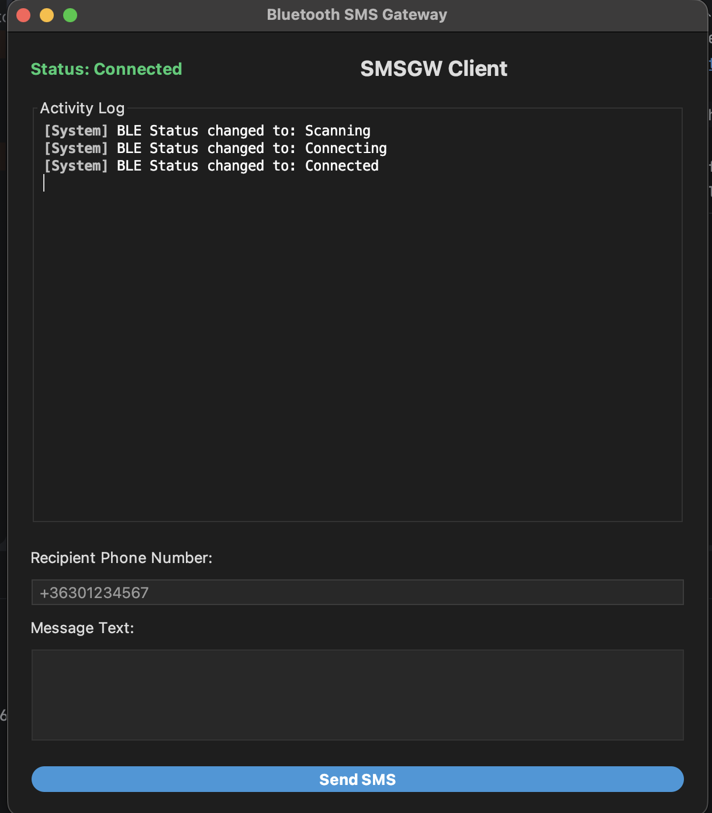

# BluetoothSmsGateway
This is an Android Studio bluetooth gateway project for Android phones.
It is advertise BLE service. You can send SMS message from [MacSMSGateway](https://github.com/pzoli/MacSMSGateway)/Java CLI/Swing client and it can forward incoming SMS to this clients.

The Android service runs in background, so you can close the GUI or lock your screen.

The JavaSE terminal client can send/receive SMSs. The JavaSE Swing client can send/receive SMSs also, plus it can download contacts from your phone and can start call, accept/reject calls.

Source is generated with OpenAI ChatGPT 5.5 and Google Gemini 3 flash pre.

The current implementation using Juul Kable is designed to work platform-independently across macOS, Linux, and Windows.
Kable uses a cross-platform backend (via the btleplug library) to talk to each OS's native Bluetooth stack:
* macOS: Uses the native Core Bluetooth framework.
* Linux: Uses the BlueZ stack via D-Bus.
* Windows: Uses the WinRT Bluetooth APIs (Windows 10+).

Clients are tested on MacOS 26.5.2 Tahoe, Ubuntu 24.04 LTS, Windows 11

Server is tested on Android 12, 16

## Requirements for Ubuntu/Debian
You need DBus headers package for Linux:
```bash
sudo apt install libdbus-1-dev
```

## Run CLI client
```bash
./gradlew :javase-client:run --args="--ble"
```

or with java jar

```bash
./gradlew :javase-client:shadowJar
java -jar javase-client/build/libs/javase-client.jar --ble
```

## Run Swing client
```bash
./gradlew :swing-client:run
```

or with java jar

```bash
./gradlew :swing-client:shadowJar
java -jar swing-client/build/libs/swing-client.jar
```


